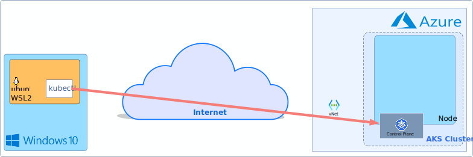

# Secure AKS API with NGINX Ziti Module

## Prerequisites

  - Azure Subscription, Resource Group and [Azure Cli](https://learn.microsoft.com/en-us/cli/azure/)
  - [OpenZiti Nginx Module Repo](https://github.com/openziti/ngx_ziti_module)
  - [Terraform](https://developer.hashicorp.com/terraform/downloads)
  - Openziti Network
  - [Desktop Tunneler](https://docs.openziti.io/docs/reference/tunnelers/)
---
## Architecture:
- Before

- After 


---

## Create OpenZiti Network

A couple of ways to do that:
- Follow the guide @[Host OpenZiti](https://docs.openziti.io/docs/learn/quickstarts/network/hosted)
- Follow the guide @[Terraform LKE Setup with OpenZiti](https://github.com/openziti-test-kitchen/terraform-lke-ziti/blob/main/README.md)

Tested with OpenZiti Network deployed  the LKE Cluster using Terraform.

---

## Create NGNIX Server and ZDE Client Identities

Follow the guide @[Create Identities](../../learn/core-concepts/identities/overview#creating-an-identity)

***Note***
client name = `client-nginx` with `Attribute`: `#clients`,  server module name = `server-nginx` with `Attribute`: `#servers`

---

# Build NGX ZITI Module and Add to Custom Ingress Controller Image

Currently, configmaps have a binary file limit of 1MB and the size of the ngx-ziti-module is around 2~3MBs. Therefore, the module can be be uploaded to the existing nginx image. One needs to build a custom image and add the module to it during the build process.

- Follow steps to build @[ngx-ziti-module](https://github.com/openziti/ngx_ziti_module/blob/main/README.md#build-using-cmake)
- Follow Steps to create @[nginx ingress controller image](https://docs.nginx.com/nginx-ingress-controller/installation/building-ingress-controller-image/#building-the-image-and-pushing-it-to-the-private-registry)

***Note***
One way to update the build is to add to thier Dockerfile (`build/Dockerfile`) this snippet of code in the common section.
```shell
####### Create common files, permissions and setcap #######
FROM ${BUILD_OS} as common
...
# copy ziti module
COPY  ./ngx_ziti_module.so /usr/lib/nginx/modules
...
```
Also, needed to add the following package `libc6` to the debian build in the same Dockerfile. Did not try the Alpine build but the assumption is that would be the same.
```shell
####### Base image for Debian ######
FROM nginx:1.23.3 AS debian
...
&& apt-get install --no-install-recommends --no-install-suggests -y libcap2-bin libc6 \
...
```
Lastly, if you don't want the image name to have a postfix of`SNAMPSHOT...` , comment it out in `Makefile`.
```shell
...
VERSION = $(GIT_TAG)##-SNAPSHOT-$(GIT_COMMIT_SHORT)
...
```

Once the image is built, upload it to your container registry. You will need it during customization of the nginx ingress controller deployment to the AKS Cluster.
:::note
if you dont have time to build your own, can use our test image based on debian 11 and nginx v1.23.3 
```shell
set {
    name = "controller.image.repository"
    value = "docker.io/elblag91/ziti-nginx-ingress"
}
```

## Deploy AKS Cluster with the custom Nginx Ingress Controller

Deploy the AKS Infrustructure in Azure using terraform. The terraform code is located at [Ziti-Cookbook Repo](https://github.com/netfoundry/ziti-cookbook). The following resources will be created, when the plan is applied.

- Virtual Network
- AKS Private Cluster with Kubenet CNI and Nginx Ingress

You will need to set a few environmental variables for Azure Authentication and Authorization.

**export ARM_SUBSCRIPTION_ID** = "xxxxxxxx-xxxx-xxxx-xxxx-xxxxxxxxxxxx"

**export ARM_CLIENT_ID** = "xxxxxxxx-xxxx-xxxx-xxxx-xxxxxxxxxxxx"

**export ARM_CLIENT_SECRET** = "xxxxxxxxxxxxxxxxxxxxxxxxxxxxxxxxxxxxxxxx"

**export ARM_TENANT_ID** = "xxxxxxxx-xxxx-xxxx-xxxx-xxxxxxxxxxxx"

Steps to follow to run terraform.
```shell
git clone https://github.com/dariuszSki/nginx-guide.git
cd nginx-guide/terraform/tf-provider
terraform init
terraform plan -out aks
terraform apply "aks"
```
Wait for resources to be deployed successfully...

Once completed, grab  `cluster_public_fqdn` under `outputs` as shown in the example below.

```shell
cluster_name = "akssandeastus"
cluster_private_fqdn = ""
cluster_public_fqdn = "akssand-uvksud51.hcp.eastus.azmk8s.io"
```

---

## Create Service

```shell
./ziti edge create service ssh --configs ssh
```

---

## Create Service Bind Policy

```shell
```

---

## Create Service Dial Policy

```shell
```

---

## Let's test our service

We will use kubectl to interact with the AKS API Controll Plane to list, create, delete context, containers, etc.

```shell
# Configure your local kube configuration file using azure cli
az login # if not already logged in
# Windows
export RG_NAME = 'resource group name'
export ARM_SUBSCRIPTION_ID =  'xxxxxxxx-xxxx-xxxx-xxxx-xxxxxxxxxxxx'
az aks get-credentials --resource-group $RG_NAME --name {cluster_name} --subscription $ARM_SUBSCRIPTION_ID

# check the installed context in the kubectl config file
kubectl config  get-contexts
CURRENT   NAME            CLUSTER         AUTHINFO                                      NAMESPACE
*         akssandeastus   akssandeastus   clusterUser_<$RG_NAME>_akssandeastus
# Let's check the status of nodes in the cluster. One should be expected!
kubctl get nodes
ERROR   Service Name not provided # if we dont provide ziti service name and identity configuration file path

kubectl get nodes --service nginx-service-01
NAME                                STATUS   ROLES   AGE    VERSION
aks-agentpool-26146717-vmss000000   Ready    agent   153m   v1.23.12

kubectl cluster-info
Kubernetes control plane is running at https://akssand-uvksud51.hcp.eastus.azmk8s.io:443
CoreDNS is running at https://akssand-uvksud51.hcp.eastus.azmk8s.io:443/api/v1/namespaces/kube-system/services/kube-dns:dns/proxy
Metrics-server is running at https://akssand-uvksud51.hcp.eastus.azmk8s.io:443/api/v1/namespaces/kube-system/services/https:metrics-server:/proxy
```
