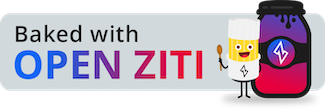
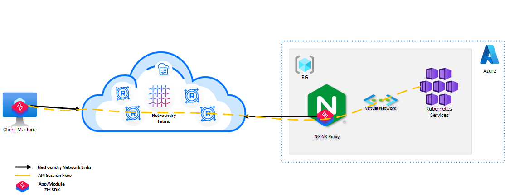
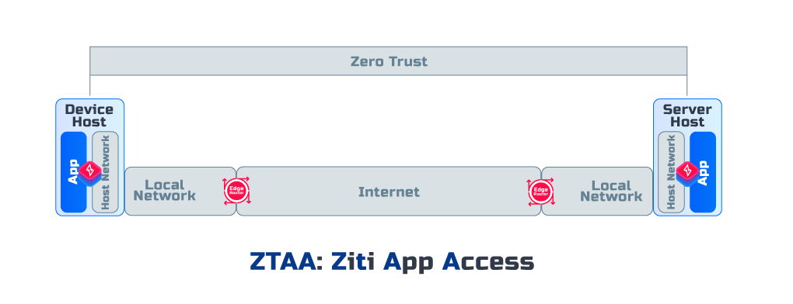

# Nginx Module Solution
## _The way to secure the Azure AKS API Service with [OpenZiti](https://github.com/openziti)_ and NGINX




## Meal Prep Time!

Here are all the ingredients you'll need to cook this meal.

- Cook Time: 1 hour
- Ingredients
  - This Repo!
  - Azure Subscription, Resource Group and CLI Access
  - [OpenZiti Nginx Module Repo](https://github.com/openziti/ngx_ziti_module)
  - [OpenZiti Golang SDK Repo](https://github.com/openziti/sdk-golang)
  - [Go installed on the client](https://go.dev/doc/install) - v1.19 or later
  - NetFoundry Teams Account (Free Tier!)
---
## Architecture:


## Zero Trust Access Level:
---
ZTAA with ZTNA


---
## Prep Your Kitchen
In order to do this demo, you will need an Azure account and permissions to create resources in that account via ARM Templates. You will also need a version of [Azure Cli](https://learn.microsoft.com/en-us/cli/azure/install-azure-cli). We suggest the latest version.
Let's run quick commands to ensure we have everything we need installed:
```
> az version
{
  "azure-cli": "2.43.0",
  "azure-cli-core": "2.43.0",
  "azure-cli-telemetry": "1.0.8",
  "extensions": {}
}
```

Once you're sure you have proper permissions in Azure and you have a compatible version of Azure Cli, go ahead and clone this repo.

---

## Create a NetFoundry Teams (Free Tier) Account
In order to start this recipe, you'll need to create a Teams account at [NetFoundry Teams](https://netfoundry.io/pricing/)

---

## Create a NetFoundry Hosted Edge Router

In order to create our Zero Trust Fabric, two major components are required. At least one [Edge Router](###-edge-router) and a [Controller](###-controller). For simplicity of this demo, we'll just create a NetFoundry hosted Edge Router.

On your NetFoundry Console, select Edge Routers, click the + button on the top right. We'll select NetFoundry Hosted and whichever the closest location to our endpoints is. Traffic is smart routed across Edge Routers. So if you're located geographically distant from the API (i.e deployed in us-east-1 and you live in APAC), you may want to create multiple Edge Routers and test out the speed benefits. For now, we'll assume our local machine is in US EST, and our API will be deployed in us-east-1. Both AWS us-east-1 and OCI **us-ashburn-1** are located in Virginia. So we'll use that. We'll name this router **demo_edge_router** and add the [Attribute](###-attribute) **demo_edge_router_attribute** (click new). You'll notice CloudZiti may have already created some prebuilt edge routers for you. If so, feel free to rename the closest geographical router available.


Additionally, we'll need to create an Edge Router Policy. Under Edge Routers, you'll see Edge Router Policies at the top:


(An auto provisioned edge router policy may already exist)

We'll name this policy **demo_edge_router_policy** and add the **#demo_edge_router_attribute** and the endpoint attribute **#all**. This should show the **demo_edge_router** in the edge routers preview. We'll add endpoints soon.


---

## Create Your First Identity

Once you've created an account at NetFoundry.io, you'll need to create a [Ziti Endpoint](###-endpoint). To do this, navigate to **Endpoints** in the navigation pannel to the left and click '+' to create a new endpoint. Let's name this endpoint **demo_api_endpoint** and assign it the [Attribute](###-attribute) **#all**. This will be the [Ziti Identity](###-identity) for the API you deploy to AWS during this recipe. Select **DOWNLOAD KEY** and save the one-time use JWT token to the folder **identity_token_goes_here**

---

## Deploy Your Nginx Server and AKS Cluster

Now that we have enrolled the Identities for Nginx Module and Client Go App with your OpenZiti fabric, we can go ahead and deploy the infrustructure in Azure using the ARM Templates. The templates included in this project will create the following resources (and their associated resources):

- Virtual Network
- AKS Private Cluster with Azure CNI
- Container Registry
- Nginx Server
- Security Group with only SSH port open to Internet

You will need to set a few environmental variables. Deploy infrastructure by running the following commands:
```bash
export LOCATION='eastus' # preferably one that does not have any infrastructure
export SUB_ID='xxxxxxxx-xxxx-xxxx-xxxx-xxxxxxxxxxxx'
export RG_NAME='resource group name' # preferably a new one for easy clean up after demo
export SSH_PKEY='ssh public key'

az login --use-device-code # using web browser if you don't have service principal access set up
az login --service-principal -u $APP_ID -p $CLIENT_SECRET --tenant $TENANT_ID

az deployment group create --name daksdeploy$LOCATION --subscription $SUB_ID --resource-group $RG_NAME --template-file files/azure/template.json --parameters files/azure/parameters.json -p location=$LOCATION acrResourceGroup=$RG_NAME adminPublicKey="$SSH_PKEY"
```
Wait for resources to be deployed successfully... Once completed, grab the AKS API FQDN and Nginx Server IP under "outputs" in the generated response as shown in the example below.

```bash
"outputs": {
      "aksApiFQDN": {
        "type": "String",
        "value": "akssand-695d32b9.0320c402-3193-454d-a593-d0a4ff6dbf5f.privatelink.eastus.azmk8s.io"
      },
      "nginxName1": {
        "type": "String",
        "value": "20.169.224.122"
      }
    },
```

---

## Build and Deploy Nginx Ziti Module
Login to Nginx Server host using ssh.
```bash
ssh -i "ssh private key" ziggy@<nginx_server_public_ip>
```
Clone Ziti Nginx Module Repo in the ziggy home directory
```bash
sudo apt update && sudo apt upgrade -y
sudo apt install libpcre3-dev libz-dev cmake make libuv1-dev build-essential jq
git clone https://github.com/openziti/ngx_ziti_module.git
```
Build the module
```bash
cd ngx_ziti_module/
mkdir cmake-build
cd cmake-build
cmake ../
make
```
Relocate the module to the Nginx's modules folder
```bash
sudo cp ngx_ziti_module.so /etc/nginx/modules/
```
Enable the ziti module in the configuration file. Just replace the existing content with 
the following data.

Note: The identity path points to the nginx directory. You will move the identiy file there after
it is is created and enrolled. 

```bash
load_module modules/ngx_ziti_module.so;

user  nginx;
worker_processes  auto;

error_log  /var/log/nginx/error.log debug;

thread_pool ngx_ziti_tp threads=32 max_queue=65536;

events {
    worker_connections  1024;
}

ziti identity1 {
    identity_file /etc/nginx/nginx-aks-id-01.json;

    bind nginx-aks-service-01 {
        upstream akssand-695d32b9.0320c402-3193-454d-a593-d0a4ff6dbf5f.privatelink.eastus.azmk8s.io:443;
    }
}
```
Restart the Nginx process.
```bash
sudo systemctl restart nginx.service
```

---

## Enroll Nginx Ziti Module
In order for **Module Endpoint** to be enrolled into OpenZiti fabric, you will need to enroll the .jwt token after the enpoint is created. The enrollment process will return xxx.json configuration file that contains mTLS certs. The, thsat json file woudl need to be moved to the nginx folder as shown in the nginx.conf file.

Install Ziti Cli first.
```bash
wget $(curl -s https://api.github.com/repos/openziti/ziti/releases/latest | jq -r .assets[].browser_download_url | grep "linux-amd64")
tar -xf $(curl -s https://api.github.com/repos/openziti/ziti/releases/latest | jq -r .assets[].name | grep "linux-amd64") 'ziti/ziti' --strip-components 1; rm $(curl -s https://api.github.com/repos/openziti/ziti/releases/latest | jq -r .assets[].name | grep "linux-amd64")
```

To enroll nginx-aks-id-01.jwt and get nginx-aks-id-01.json as a return. If this JSON object is correctly generated, you've enrolled your **Endpoint** correctly (see image below)! 

Enroll dowloaded JWT 
```bash
./ziti edge enroll -j nginx-aks-id-01.jwt -o nginx-aks-id-01.json
```

---

## Build Client Go HTTP App

Clone OpenZiti Golang SDK Repo on your client

Note: Need to install gcc compiler if not already installed
```powershell
git clone https://github.com/openziti/sdk-golang.git
cd sdk-golang/example
mkdir build
go mod tidy
go build -o build ./...
```
Test Client app
```powershell
build/curlz
Insufficient arguments provided

Usage: ./curlz <serviceName> <identityFile>
```
If you get the error like above, then the client app was built successfully

---

## Enroll Client App Identity

Install Ziti Cli first.
```powershell
wget $($(Invoke-RestMethod -uri https://api.github.com/repos/openziti/ziti/releases/latest).assets |  where-object { $_.name -match "windows"}).browser_download_url -UseBasicParsing -OutFile $($(Invoke-RestMethod -uri https://api.github.com/repos/openziti/ziti/releases/latest).assets |  where-object { $_.name -match "windows"}).name

Expand-Archive -LiteralPath $($(Invoke-RestMethod -uri https://api.github.com/repos/openziti/ziti/releases/latest).assets |  where-object { $_.name -match "windows"}).name -DestinationPath ./

rm $($(Invoke-RestMethod -uri https://api.github.com/repos/openziti/ziti/releases/latest).assets |  where-object { $_.name -match "windows"}).name
```

To enroll nginx-aks-client-01.jwt and get nginx-aks-client-01.json as a return. If this JSON object is correctly generated, you've enrolled your **Endpoint** correctly (see image below)! 

Enroll dowloaded JWT 
```bash
./ziti edge enroll -j nginx-aks-client-01.jwt -o nginx-aks-client-01.json
```

---

## Check Our Progress!

Now that you've enrolled your [Ziti Endpoint](###-endpoint) and spun up a Fargate Task to run a sidecar in front of an API, we should be able to see a few indicators of success. First, let's look at your **Network Dashboard** for nfconsole.io. Here we should see that the **demo_api_endpoint** has been created and is online!


This shows that we have successfully enrolled the Endpoint with the Controller (```make enroll```). If you just ran ```make```, you will not see the json object locally but will see it created successfully here.


This shows that we have successfully spun up an Endpoint that is enrolled with the Controller.

---

## What Makes This API "Dark"?

In the infrastructure you have deployed via Terraform, you will see that the Security Group in front of the ECS Service has no ingress allowed. This protects us from attacks like SCaN. In order to access a "Dark" API, you will need to have both Endpoints (user and API) explicitly allowed via [AppWAN](***APPWans). Then, you will need the connecting Endpoint (in this case your laptop) to be on the same Ziti Fabric. We will accomplish this by using the Ziti Desktop Edge.

## Creating Local Endpoint With ZDE

In order to access the dark_api_endpoint, we'll need to create a **local_endpoint** and give it the same attribute as the **demo_api_endpoint** (#all). Once you have created the new Endpoint, download the key and in step 2 of the registration screen, install the correct ZDE for your OS.


Now you'll want to add the new Identity that you've downloaded. On the Mac client, it will look like this. Click the + on the bottom left and select local_endpoint.jwt and click "Enroll". This will enroll your local machine with the Controller just as we've done previously with your Ziti Sidecar. Just as before, if you check your Network Dashboard on nfconsole.io, you should see your local_endpoint created and online.


---

## Creating a Service

In order for your Ziti Sidecar and Demo API to be recognized on the fabric, we must register it as a [Service](###-service).

For this, we'll create a Simple Service. On the nfconsole.io dashboard, select Services and the + on the top right. Then select Simple Service and Create Service. We'll name the service **demo_api_service** and give it the service attribute **demo_api_service_attribute** and edge router attribute **demo_edge_router_attribute**.

This service is configuring the traffic for the associated endpoint. So we'll create a new address for our sidecar as **demo.api** and route traffic to it via port 80. The **endpoint** we're attempting to access is **@demo_api_endpoint**. Next, we'll tell it to forward traffic to **localhost** on port 8080. This will route all traffic from our local machine to demo.api:80 via ZDE to our demo API on localhost:8080.


---

## Adding Endpoints to an AppWAN

As mentioned before, in order to allow our local Endpoint (ZDE) to access our deployed Endpoint (sidecar and demo API), we'll need to assign them to the same [AppWAN](###-appwan). Under AppWANs on our nfconsole.io dashboard, click the plus sign to create a new AppWAN. Let's name it **demo_api_appwan** with our service attribute **demo_api_service_attribute** (we can also explicilty use **@demo_api_service**). We're looking to connect our **local_endpoint** to our **demo_api_service**. We can either explicitly add both of those under **Endpoint Attributes** or, since we only have two endpoints, we can use **#all**. This should add both the service and endpoint to the preview on the right.


## It's Alive!!

Everything should be connected as expected now. Let's look again to ensure everything is as expected.

Now our event history should look as follows (ignore netfoundry-poc): 


And our ZDE should show the expected connection:


Now let's try and connect to our API! 

In your terminal, postman, or browser simply connect to [demo.api:80 ](http://demo.api/) and you should get a return of "Hello World (Python)! (up 0:15:29)" based on how long your API has been running.

## A Few Good Tests

In order to ensure that traffic is flowing as we expected and is truly dark, there are a few quick things we can check.

First, let's see our traffic!

In Fargate, you can look at your cloudwatch logs (log group /ecs/fargate_log_group/demo_api/) and for your ziti-tunneller you should see:
 ```
 INFO tunnel-cbs:ziti_hosting.c:611 on_hosted_client_connect() hosted_service[demo_api_service], client[local_endpoint] dst_addr[tcp:demo.api:80]: incoming connection
 ```
 Here we can see the name of the service, the client connection, and the address it connected over. In your app logs, you should see:
 ```
 127.0.0.1 - - [24/Oct/2022 19:18:49] "GET / HTTP/1.1" 200 -
 ```
 This is our incoming GET request from our local machine.

 If we go to Services on our nfconsole.io dashboard and click into our **demo_api_service**, there is a metrics option on the top left. That will show us that our traffic is all coming from **local_endpoint**. As you add more Endpoints, you will be able to track traffic here.

 The last test is to disconnect our Ziti Desktop Edge (ZDE) and try to connect again. We'll see that the address "dark.api:80" no longer exists to our network.

## NetFoundry Terminology
### Endpoint

Endpoints are light-weight agents that are installed on your devices or in an APP as a SDK. Endpoints are enrolled to the NetFoundry network using the registration process via one-time use secure JWT. 

See more [here](https://support.netfoundry.io/hc/en-us/sections/360002445391-Endpoints) to learn more about endpoints in NetFoundry and how to create & install endpoints. 

### Identity

Attributes are applied to Endpoints, Services, and Edge Routers. These are tags that are used for identifying a group or a single endpoint / service / edge router. Attributes are used while creating APPWANs. The @ symbol is used to tag Individual endpoints / services / edge routers and # symbol is used to tag a group of endpoints / services / edge routers.

[Learn more](https://support.netfoundry.io/hc/en-us/articles/360045933651-Role-Attributes) on how attributes simplify policy management in NetFoundry.

### Controller

The Controller is the central function of the network. The controller provides the control plane for the software defined network for management and configurations. It is responsible for configuring services, policies as well as being the central point for managing the identities used by users, devices and the nodes making up the Network. Lastly but critically, the Controller is responsible for authentication and authorization for every connection in the network.

### Edge Router

NetFoundry Hosted Router –

NetFoundry fabric is a dynamic mesh of hosted edge routers that are enabled to receive traffic.  The fabric is dedicated per network and carries traffic only within the network. NF fabric provides the best path for traffic to reach the destination node from the source node. [This document](https://support.netfoundry.io/hc/en-us/articles/4410429194125-NetFoundry-Smart-Routing) covers details about NF's smart routing, how edge routers make routing decisions and how the best path is selected. A min of 1 hosted edge router is required and two or more routers are suggested to create a fabric.

Customer Edge Router –

Customer edge routers are spun up by customers at their private data center / public clouds / branch locations in their LAN. The role of an edge router is to act as a gateway to NetFoundry network to send / receive packets between the apps  and a NetFoundry Network. Edge routers can either host services or act as a WAN gateway to access services in an APPWAN.

See more [here](https://support.netfoundry.io/hc/en-us/articles/360044956032-Create-and-Manage-Edge-Routers) to learn more about edge routers in NetFoundry and how to create & install edge routers.

### Attribute

Attributes in NetFoundry provide a user-friendly approach for grouping endpoints, services, and policies in configuring networks.

See more [here](https://support.netfoundry.io/hc/en-us/articles/360045933651-Role-Attributes) and check out the [Attribute Explorer](https://support.netfoundry.io/hc/en-us/articles/360027780971-Introduction-to-the-Network-Dashboard#h_01G4VQZ22VMTC1PY6FYM2S250D)


### AppWAN

AppWans are like a policy that defines which endpoints can access which services. AppWANs are micro perimeters within your network. Each network can have many APPWANs. AppWANs are a combination of services & endpoints that have to access the services.

See more [here](https://support.netfoundry.io/hc/en-us/sections/360002806392-AppWANs-Services) on how to create and manage APPWANs.

### Service

Services define resources on your local network that you want to make available over your NetFoundry network. Once you've created a service, add it to one or more AppWANs to make it available to those AppWAN members. Think of a service as a rule in a firewall whitelist, which defines the exact set of network resources that one may access over an AppWAN, while all other traffic is blocked.

See more [here](https://support.netfoundry.io/hc/en-us/articles/360045503311-Create-and-Manage-Services) on how to create services.


### NetFoundry Teams (Free Tier)

NetFoundry has created a Teams tier that is free up to 10 nodes. All examples that include this in their ingredients can be done with less than 10 nodes and can be done for free!


Terraform:
RESOURCE_GROUP_NAME=tfstate
STORAGE_ACCOUNT_NAME=tfstate20823
CONTAINER_NAME=tfstate
az login --service-principal --username $CLIENT_ID --password $CLIENT_SECRET --tenant $TENANT_ID 
ACCOUNT_KEY=$(az storage account keys list --resource-group $RESOURCE_GROUP_NAME --account-name $STORAGE_ACCOUNT_NAME --subscription $SUB_ID --query '[0].value' -o tsv)
export ARM_ACCESS_KEY=$ACCOUNT_KEY
terraform plan -var SUB_ID=$SUB_ID
terraform apply -destroy -target=helm_release.ingress-nginx -var $SUB_ID


Kubernetes:
build/kubeztl get pods --service AKS-Advanced-Service --zConfig ~/Desktop/terraform_az.json  -n ingress-nginx -l app.kubernetes.io/name=ingress-nginx --watch

build/kubeztl get pods --service AKS-Advanced-Service --zConfig ~/Desktop/terraform_az.json -n ingress-nginx
build/kubeztl get pods --service AKS-Advanced-Service --zConfig ~/Desktop/terraform_az.json -n ingress-nginx
build/kubeztl logs --service AKS-Advanced-Service --zConfig ~/Desktop/terraform_az.json -n ingress-nginx  akssand-nginx-ingress-nginx-controller-7c8866f8fb-5kj42


build/kubeztl describe ing --service AKS-Advanced-Service --zConfig ~/Desktop/terraform_az.json -n ingress-nginx  --show-events=true

build/kubeztl get svc --service AKS-Advanced-Service --zConfig ~/Desktop/terraform_az.json --all-namespaces
build/kubeztl get deploy --service AKS-Advanced-Service --zConfig ~/Desktop/terraform_az.json -n ingress-nginx
build/kubeztl edit deploy --service AKS-Advanced-Service --zConfig ~/Desktop/terraform_az.json -n ingress-nginx akssand-nginx-ingress-nginx-controller
annotation key "meta.helm.sh/release-name" must equal "nginx-ingress": current value is "akssand-nginx"; 
annotation key "meta.helm.sh/release-namespace" must equal "default": current value is "nginx-ingress";


Steps:
Mattermost:
helm repo add mattermost https://helm.mattermost.com


build/kubeztl create configmap nginx-configuration --service AKS-Advanced-Service --zConfig ~/Desktop/terraform_az.json -n nginx-ingress --from-file=./nginx-controller-configmap-custom.yaml
build/kubeztl delete configmap nginx-configuration --service AKS-Advanced-Service --zConfig ~/Desktop/terraform_az.json -n nginx-ingress

build/kubeztl  exec --service AKS-Advanced-Service --zConfig ~/Desktop/terraform_az.json -n default nginx-ingress-nginx-ingress-5796bf945b-rd4wb -- cat ../../ngx_ziti_module.so /etc/nginx/modules/ngx_ziti_module.so 

build/kubeztl cp  --service AKS-Advanced-Service --zConfig ~/Desktop/terraform_az.json ../../ngx_ziti_module.so nginx-ingress-nginx-ingress-5796bf945b-rd4wb:/etc/nginx/modules/ngx_ziti_module.so

build/kubeztl  exec --service AKS-Advanced-Service --zConfig ~/Desktop/terraform_az.json -i nginx-ingress-nginx-ingress-5796bf945b-rd4wb -- ls /etc/nginx/modules/   

cat ../../ngx_ziti_module.so | build/kubeztl  exec --service AKS-Advanced-Service --zConfig ~/Desktop/terraform_az.json -i nginx-ingress-nginx-ingress-5984988596-58bl2 --  tee /var/run/secrets/openziti.io/ngx_ziti_module.so > /dev/null

build/kubeztl exec --service AKS-Advanced-Service --zConfig ~/Desktop/terraform_az.json -it  nginx-ingress-nginx-ingress-5984988596-58bl2  -- cat /etc/nginx/nginx.conf

